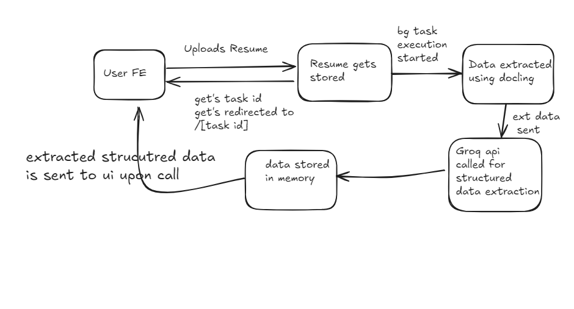

## 🎯 Introduction

**Goal**:  
To build a lightweight resume parsing system that extracts structured information (like name, email, education, skills) from uploaded resumes using LLM-powered inference.

---

## 🧭 System Architecture Diagram

---
## 🧱 Components Breakdown

### 1. **Frontend (User Interface)**

- **Technology**: React
- **Responsibilities**:
    - Presents a user-friendly **file upload form**
    - Sends resumes to the backend using `POST /upload`
    - Receives a `task_id` upon successful upload
    - Redirects the user to a result page: `/[task_id]`
    - **Polls** the backend periodically using `GET /status/{task_id}` to check if parsing is complete
    - Once processing is complete, fetches parsed data using `GET /result/{task_id}` and renders it on the UI

---
### 2. **Backend API (FastAPI)**
- **Technology**: FastAPI (Python)
- **Responsibilities**:
    - Provides REST API endpoints:
        - `POST /upload` – Accepts and stores the resume
        - `GET /status/{task_id}` – Returns current processing status (`pending`, `done`, `failed`)
        - `GET /result/{task_id}` – Returns parsed structured data if available
    - Stores uploaded resume files temporarily (in memory or disk)
    - Initiates the **background processing task** asynchronously
    - Manages task IDs and status tracking

---
### 3. **Background Task (Parsing + Inference Pipeline)**
- **Trigger**: Automatically started after a resume is uploaded
- **Responsibilities**:
    1. **Text Extraction**:
        - Uses **Docling** to extract raw text from uploaded resume files (PDF, DOCX, etc.)
    2. **LLM-Powered Inference**:
        - Sends extracted text to the **Groq API** using LLM prompts
        - Uses `with_structured_output()` to ensure predictable JSON structure
    3. **Result Storage**:
        - Stores structured output in memory (e.g., Python dictionary or Redis)
        - Updates task status to `done` for frontend polling to retrieve results

---
## ✅ Key Flow Summary
1. User uploads resume via React UI
2. FastAPI stores the file and triggers background processing
3. Docling extracts the text
4. Groq API infers structured fields
5. Processed data is stored in memory
6. UI polls for task status → shows results when available

---